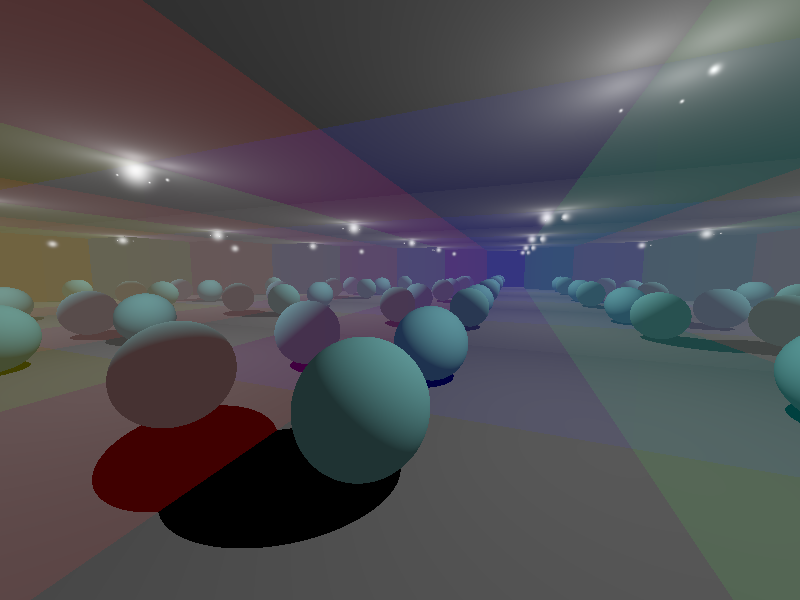

# Ray tracer
Backward ray tracer with reflected and refracted illuminations.
## Description
Basic ray tracer works with spheres and triangles.

Vertical FOV is 45.
## Usage:
Executable file is "raytracer"

Command line arguments in strict order: 
  * Object filename
  * Width of camera resolution
  * Height of camera resolution
  * X coordinate of camera
  * Y coordinate of camera
  * Z coordinate of camera
  * X coordinate of point camera looking at
  * Y coordinate of point camera looking at
  * Z coordinate of point camera looking at
  * Depth of recursion to calculate reflected and refracted illuminations
  * Result filename to store rendered png

Example of usage:
  ./raytracer scene.obj 800 600 2 1.5 '-0.1' 1 1.2 '-2.8' 9 mine.png
  
## Result examples

